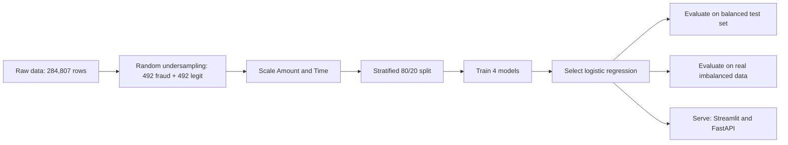

# Fraud Shield: Credit Card Fraud Detection

[](https://github.com/nikhil-kumarrr/Credit-Card-Fraud-Detection/actions/workflows/ci.yml)


Fraud Shield scores credit card transactions for fraud risk. It pairs a logistic regression model trained on the public ULB dataset with an interactive Streamlit dashboard and a FastAPI service, and is backed by a test suite and continuous integration.

[Demo](#demo) | [Results](#results) | [Getting started](#getting-started) | [API](#api-reference) | [Project structure](#project-structure) | [Model card](#model-card) | [Contributing](#contributing)

## Demo

**Live app:** PASTE_YOUR_STREAMLIT_LINK_HERE


The dashboard pulls a real transaction from the dataset (with its genuine V1-V28 features), lets you edit the amount and hour, and returns a fraud probability, a risk level and the features that pushed the score up or down.

## Highlights

- Complete workflow: exploratory analysis, class rebalancing, comparison of four models, and evaluation on the original imbalanced data.
- Two interfaces to the same model: a Streamlit dashboard and a validated REST API.
- Reproducible: pinned dependencies, fixed random seeds and a training script that never overwrites the deployed model.
- Engineering practice: 27 automated tests, lint and format checks, and GitHub Actions on every push.

## The problem

Card fraud is rare but expensive. In this dataset only 492 of 284,807 transactions (0.17%) are fraudulent, so plain accuracy is misleading: a model that always predicts "legit" is 99.8% accurate and catches nothing. This project therefore reports recall, precision, ROC-AUC and PR-AUC, and checks the chosen model on the real class distribution instead of only on a balanced test set.

## Dataset

| Property | Value |
| --- | --- |
| Source | [Credit Card Fraud Detection](https://www.kaggle.com/datasets/mlg-ulb/creditcardfraud) (ULB Machine Learning Group) |
| Transactions | 284,807 (492 fraud, 284,315 legit) |
| Features | `V1` to `V28` (anonymised PCA components), `Time`, `Amount` |
| Target | `Class` (1 = fraud, 0 = legit) |
| Location | `data/creditcard.csv.gz`, kept in the repository because the dashboard reads it |
## Methodology



1. **Rebalancing.** Keep all 492 frauds and sample 492 legit transactions at random (seed 42), giving 984 rows.
2. **Scaling.** Standardise `Amount` and `Time`. The V features are already PCA outputs.
3. **Model comparison.** Logistic regression, decision tree, random forest and k-nearest neighbours on a stratified 80/20 split.
4. **Model choice.** Logistic regression matches the random forest on test accuracy without overfitting (train 96.1% against 100% for the tree-based models), and its coefficients make per-transaction explanations straightforward.
5. **Honest evaluation.** The selected model is re-scored on every transaction that was not used for training, which keeps the real fraud rate.

## Results

Model comparison on the balanced test set (197 transactions):

| Model | Train accuracy | Test accuracy |
| --- | --- | --- |
| Logistic regression | 96.1% | 93.4% |
| Decision tree | 100% | 89.3% |
| Random forest | 100% | 93.4% |
| K-nearest neighbours | 95.3% | 92.4% |

Logistic regression reaches **0.978 ROC-AUC** on this set, with fraud precision 0.97 and recall 0.90.

A balanced test set hides the real difficulty, so the same model is also scored on the original imbalanced data (284,020 transactions, 98 frauds):

| Metric | Value |
| --- | --- |
| ROC-AUC | 0.977 |
| Fraud recall | 0.898 |
| Fraud precision | 0.0096 |
| PR-AUC | 0.354 |

**Reading these numbers.** The model separates fraud from legit well (ROC-AUC 0.977) and catches about 90% of frauds at the default 0.5 threshold. Because frauds are so rare, that threshold also flags roughly 100 legit transactions for every real fraud. A production system would tune the threshold against the relative cost of a missed fraud and a false alarm; this is the main item on the roadmap.
## Getting started

Requires Python 3.10 to 3.12 (the pinned `numpy==1.26.4` has no wheels for Python 3.13).

```bash
git clone https://github.com/nikhil-kumarrr/Credit-Card-Fraud-Detection.git
cd Credit-Card-Fraud-Detection
python -m venv .venv
source .venv/bin/activate          # Windows: .venv\Scripts\activate
pip install -r requirements.txt
```

Run the dashboard:

```bash
streamlit run app/streamlit_app.py
```

Run the API (needs the development requirements, see [Testing](#testing-and-code-quality)):

```bash
pip install -r requirements-dev.txt
uvicorn fraud_detection.api:app --app-dir src
```

Interactive API documentation is then available at `http://127.0.0.1:8000/docs`.

Retrain the model. Output goes to `models/retrained`, so the deployed model is never overwritten:

```bash
export PYTHONPATH=src              # PowerShell: $env:PYTHONPATH="src"
python -m fraud_detection.train
```

Score transactions from Python:

```python
from fraud_detection.predict import FraudPredictor

predictor = FraudPredictor.from_dir("models")
probabilities = predictor.predict_proba(transactions_df)   # one probability per row
```

The files in `models/` were produced by `notebooks/01_eda.ipynb` with scikit-learn 1.5.1, which is why that version is pinned. `src/fraud_detection/train.py` reproduces the same approach as a script.

## API reference

| Method and path | Purpose |
| --- | --- |
| `GET /health` | Service status and version |
| `POST /predict?threshold=0.5` | Fraud probability, decision and risk level for 1 to 1000 transactions |

Each transaction needs `Time`, `Amount` (not negative) and `V1` to `V28`.

```python
import requests

row = {"Time": 0.0, "Amount": 149.62, **{f"V{i}": 0.0 for i in range(1, 29)}}
response = requests.post("http://127.0.0.1:8000/predict", json={"transactions": [row]})
print(response.json())
```

Example response:

```json
{
  "threshold": 0.5,
  "predictions": [
    {"fraud_probability": 0.048, "is_fraud": false, "risk_level": "low"}
  ]
}
```

Risk levels are `low` (below 30%), `medium` (30% to 70%) and `high` (70% and above). Invalid input, such as a negative amount, a missing feature, an empty batch or a threshold outside 0 to 1, returns HTTP 422.
## Project structure

```
.
|-- app/streamlit_app.py        Streamlit dashboard
|-- app.py                      Entry point used by Streamlit Cloud
|-- src/fraud_detection/
|   |-- data.py                 Loading and validation
|   |-- features.py             Scaling and column alignment
|   |-- train.py                Undersampling, training and evaluation
|   |-- predict.py              FraudPredictor (inference)
|   `-- api.py                  FastAPI service
|-- tests/                      pytest suite (data, features, model, API)
|-- models/                     Saved model, scalers and feature columns
|-- data/                       Dataset (see data/README.md)
|-- notebooks/01_eda.ipynb      Exploration and model comparison
|-- docs/screenshots/           Images used in this README
|-- .github/workflows/ci.yml    Lint, format check and tests
|-- pyproject.toml              pytest, ruff and coverage configuration
`-- CONTRIBUTING.md             Setup and contribution guide
```

## Testing and code quality

```bash
pip install -r requirements-dev.txt
pytest --cov
ruff check src tests
ruff format --check src tests
```

The 27 tests cover data validation, feature engineering, training and inference, and the API (valid requests, thresholds and every rejected input). GitHub Actions runs lint, format check and tests on every push and pull request.
## Model card

- **Intended use:** an educational and portfolio demonstration of fraud scoring.
- **Out of scope:** real payment decisions. The model was trained on a small, old and anonymised sample and has not been validated for production.
- **Training data:** public ULB dataset (European cardholders, September 2013, two days of transactions). Features are anonymised PCA components, so no personal data is involved.
- **Training set:** 984 rows after random undersampling.
- **Performance:** see [Results](#results). ROC-AUC is about 0.977 on the real imbalanced data, but precision at the 0.5 threshold is below 1%.
- **Known limitations:** undersampling discards most legit transactions, the data covers a short period, and explanations are model coefficients on anonymised features.
- **Risks:** false positives would block genuine customers, so any real deployment needs threshold tuning and human review.

## Roadmap

- Tune the decision threshold for the cost of a missed fraud versus a false alarm
- Compare gradient boosting and SMOTE or cost-sensitive learning against undersampling
- Add precision-recall curves and SHAP explanations to the dashboard
- Add a Dockerfile for the API
## Contributing

Contributions are welcome. See [CONTRIBUTING.md](CONTRIBUTING.md) for setup, checks and guidelines.

## License

Released under the MIT License. See [LICENSE](LICENSE).

## Acknowledgements

Dataset: Andrea Dal Pozzolo, Olivier Caelen, Reid A. Johnson and Gianluca Bontempi. *Calibrating Probability with Undersampling for Unbalanced Classification.* IEEE Symposium on Computational Intelligence and Data Mining (CIDM), 2015.

## Author

Nikhil Kumar, MCA, IIT Patna. GitHub: [nikhil-kumarrr](https://github.com/nikhil-kumarrr)